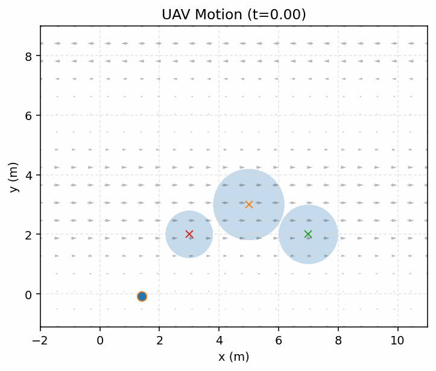
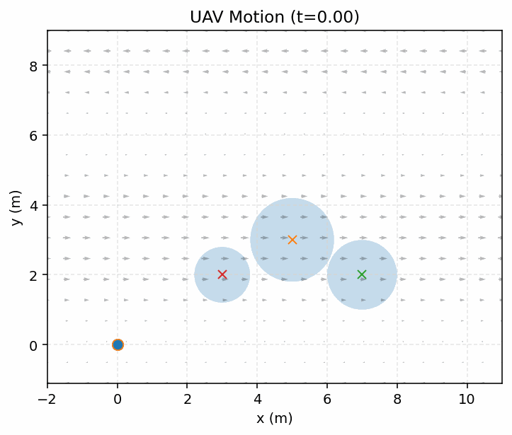
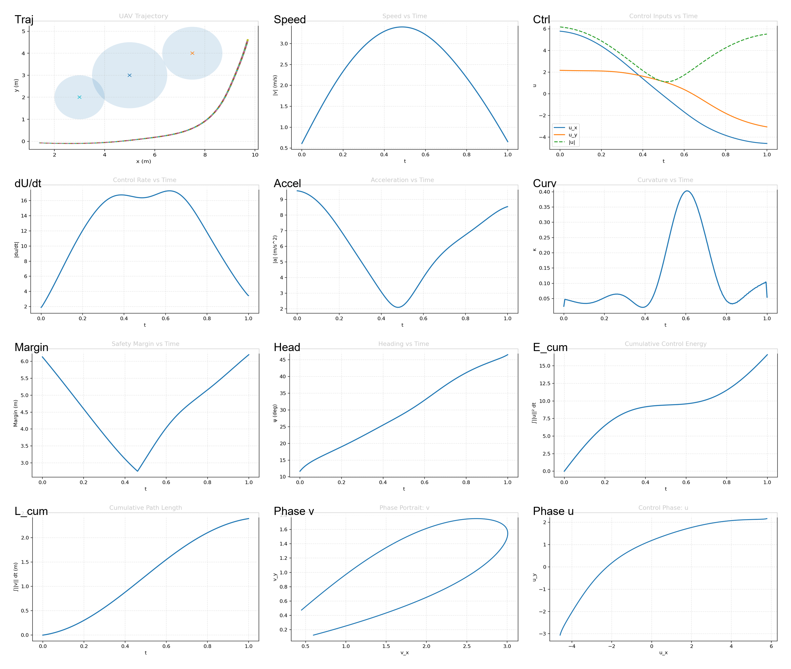
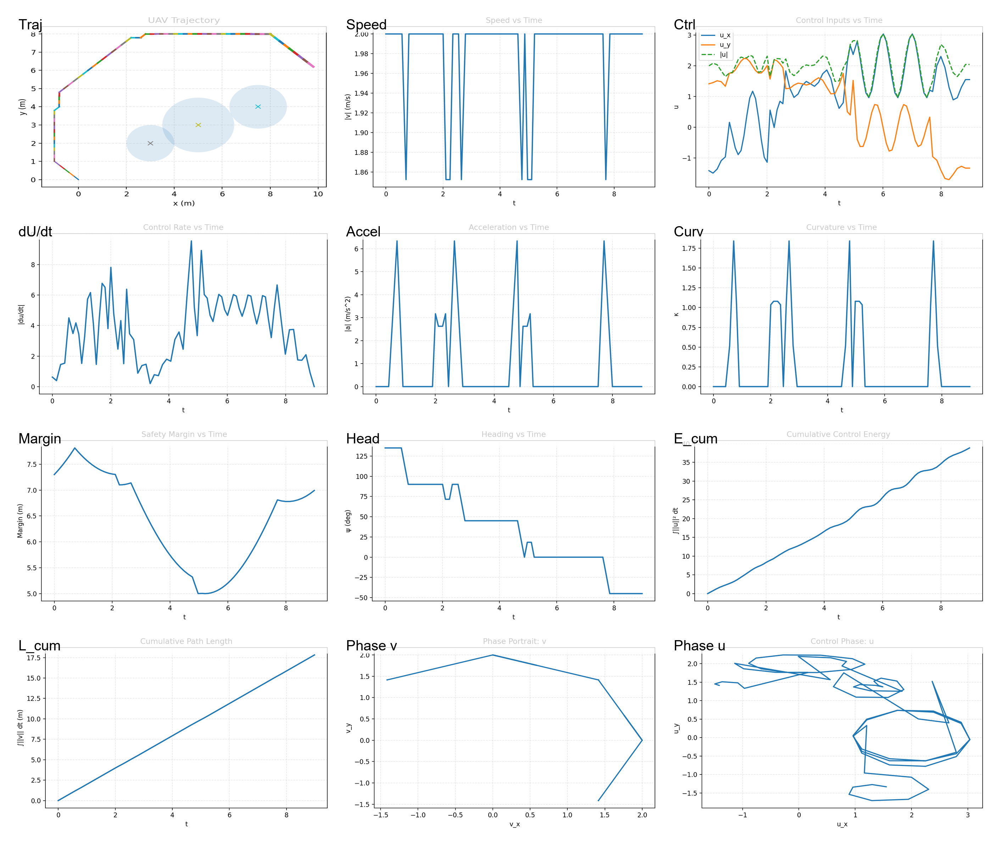
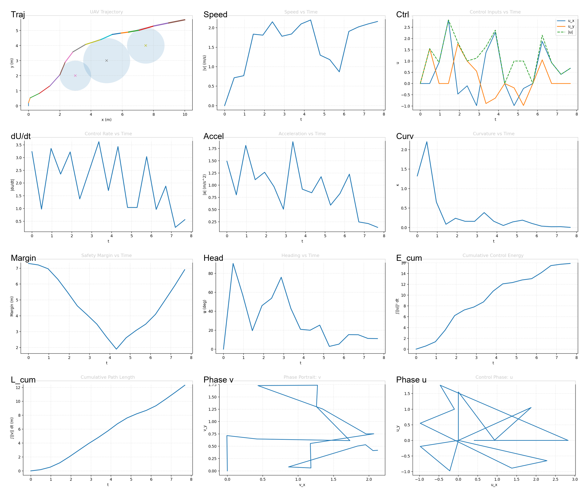
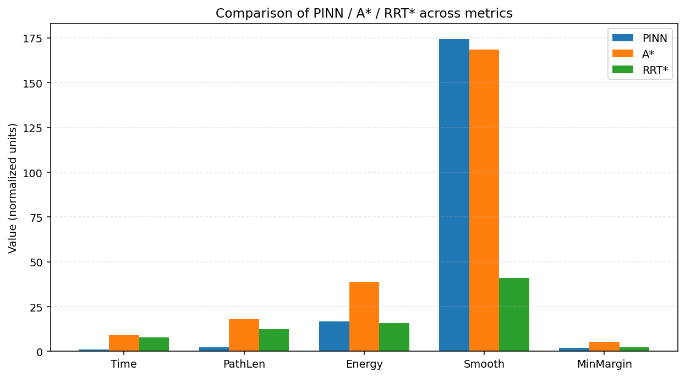

<!-- ===== UAV-PINN README Visual Section ===== -->

# 🛰️ Physics-Informed UAV Trajectory Planning  
*A Unified Learning–Physics Framework for Safe, Smooth, and Energy-Efficient Flight in Dynamic Environments*  

<!-- ===== Main Animation ===== -->

<em>Figure 1. Trajectory evolution of the proposed Physics-Informed Neural Network (PINN) model under dynamic wind fields.</em>

---

### ✈️ Comparative Flight Dynamics

<table>
<tr>
<td align="center"><b>A* Algorithm</b> </td>
<td align="center"><b>Kino-RRT*</b> </td>
</tr>
</table>

<em>Figure 2. Baseline trajectories of A* (left) and Kino-RRT* (right) in the same environment.  
Both rely on discrete sampling and lack dynamic smoothness compared to the PINN approach.</em>

---

### 🧠 Evolution of Model Parameters

<table>
<tr>
<td align="center"> <em>(a) PINN Loss Convergence</em></td>
<td align="center"> <em>(b) A* Energy Profile</em></td>
<td align="center"> <em>(c) RRT* Energy Profile</em></td>
</tr>
</table>

<em>Figure 3. Training and control-energy evolution across different algorithms.  
The PINN demonstrates smoother convergence and lower energy oscillation amplitude.</em>

---

### 📊 Quantitative Comparison

<em>Figure 4. Quantitative evaluation of flight performance:  
energy consumption, smoothness, and risk proximity.  
The physics-informed model achieves the best trade-off across all metrics.</em>

